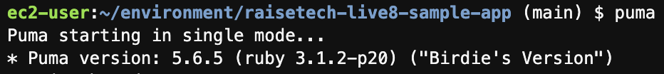
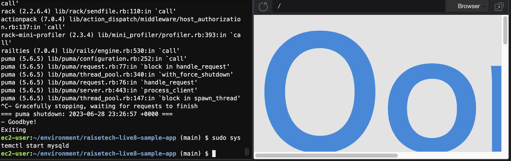
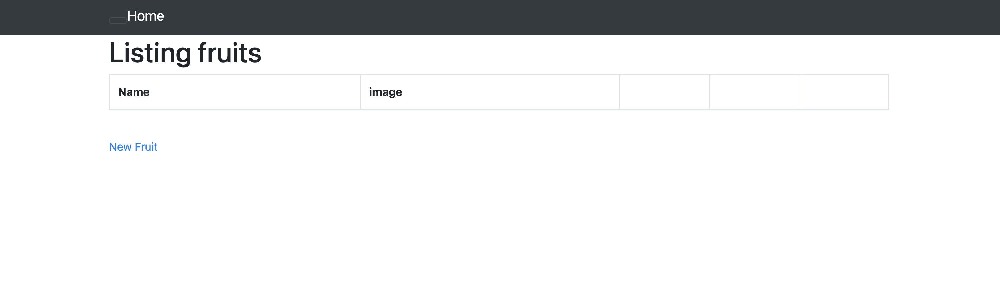
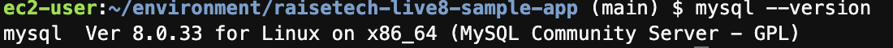
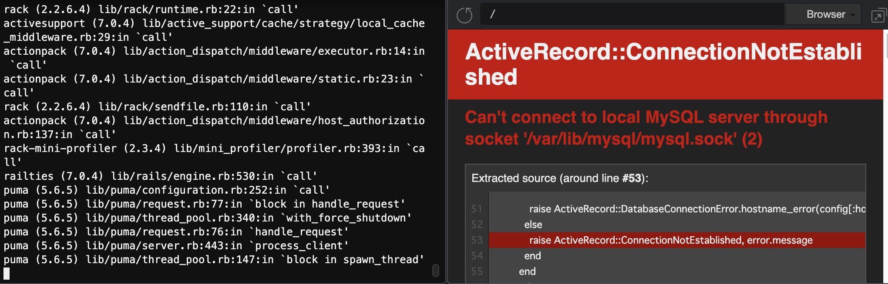

# 第3回課題

APサーバーの名前とバージョンを確認してみましょう。

Puma Ver 5.6.5  

AP サーバーを終了させた場合、引き続きアクセスできますか？

アクセスできない

APサーバーを起動してください

サンプルアプリケーションで使ったDBサーバーの名前と、今Cloud9で動作しているバージョンはいくつか

MySQL Ver 8.0.33

DBサーバーを終了させた場合、引き続きアクセスできますか?

アクセスできない

Railsの構成管理ツールの名前は何でしたか?

Bundler

