# 第5回課題

### 組み込みサーバの動作確認

``` sudo yum -y install mysql ```

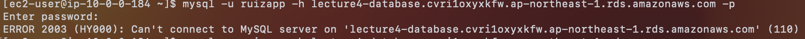

ここで RDSにmysql -u ユーザ名 -h エンドポイント -p で接続しようとするが、タイムアウトになる。原因はEC2を作り直して、RDSのEC2接続セットアップを忘れていたためだった。


修正して無事接続できました！    


railsアプリが動くようにパッケージをインストール

```
sudo yum -y install gcc-c++ make patch git curl zlib-devel openssl-devel ImageMagick-devel readline-devel libcurl-devel libffi-devel libicu-devel libxml2-devel libxslt-devel
```

アプリの配置ディレクトリを作成
 
```sudo mkdir -p /var/www```


/var/www配下にアプリケーションをクローンする(git clone <リポジトリのURL>)

JavaScriptを実行できるように、Node.jsをインストール

```
curl -sL https://rpm.nodesource.com/setup_14.x | sudo bash -

sudo yum -y install nodejs

```

Rails6以降はyarnを使うので、yarnもインストールする

```
curl -sL https://dl.yarnpkg.com/rpm/yarn.repo | sudo tee /etc/yum.repos.d/yarn.repo

sudo yum -y install yarn

```

rubyのバージョン管理ツールであるrbenvをインストール


```
git clone https://github.com/sstephenson/rbenv.git ~/.rbenv

echo 'export PATH="$HOME/.rbenv/bin:$PATH"' >> ~/.bash_profile

echo 'eval "$(rbenv init -)"' >> ~/.bash_profile

source .bash_profile

```


sourceコマンドを打ったが反映されなかったので、一旦exitして再びEC2にSSH接続したら反映された。

rubyをインストールするためのruby-buildをインストール


```

git clone https://github.com/sstephenson/ruby-build.git ~/.rbenv/plugins/ruby-build

rbenv install 3.1.2

```


bundlerのインストール

```gem install bundler```

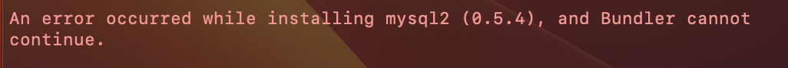

その前に、My SQLのセットアップするんだった(*･ω･)ﾉ


bundlerのインストール後、bin/setupを実行するとエラーが…


```sudo chown ec2-user raisetech-live8-sample-app/```


権限を与えて再び実行すると、またもエラー…


```sudo chown ec2-user /var/www/raisetech-live8-sample-app/tmp/```


これで再び実行すると、無事成功した。


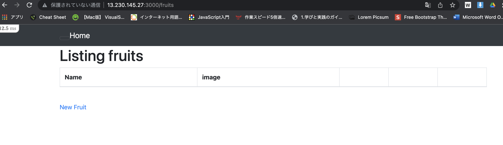

これでアプリケーションが起動した。


## Unicorn+Nginx

config/unicorn.rbの設定

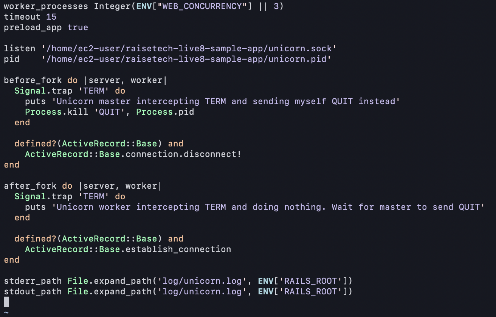

```bundle exec unicorn_rails -c config/unicorn.rb```→成功


###  Nginx動作確認

```
sudo amazon-linux-extras install nginx1

sudo systemctl start nginx

```

起動成功


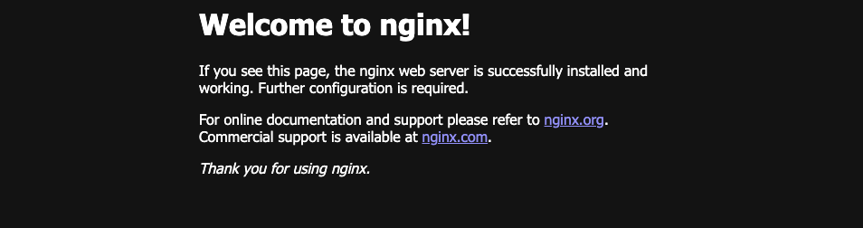


### /etc/nginx/nginx.confの設定


```sudo systemctl start nginx```

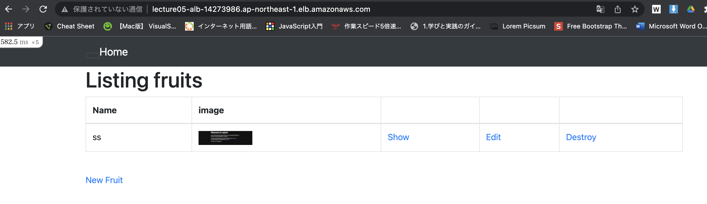


## RDS動作確認


写真を送信したら、↑このようなエラーが出たのでstorage/をPermissionをrootからec2-userに変更

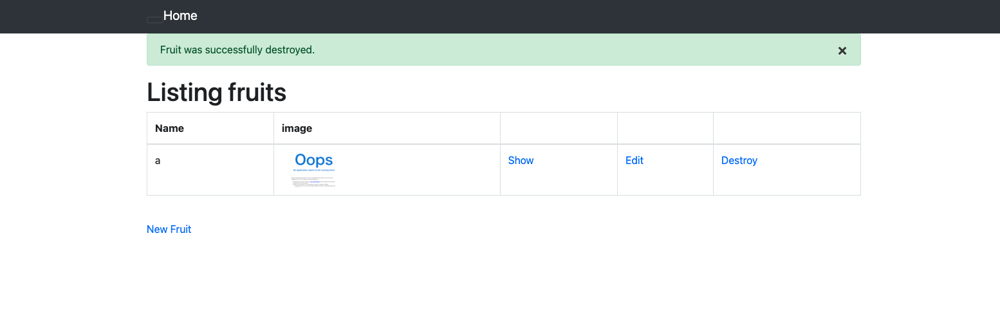

エラーが解消され、画像もアップできた(いや、フルーツの画像じゃないんかい∑(ﾟДﾟ)）


## ELB起動確認

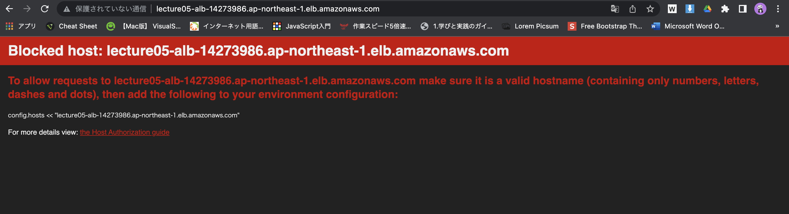

```sudo vi config/environments/development.rb```


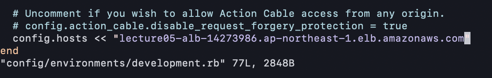

development.rbにRDSのエンドポイントを追加すると…

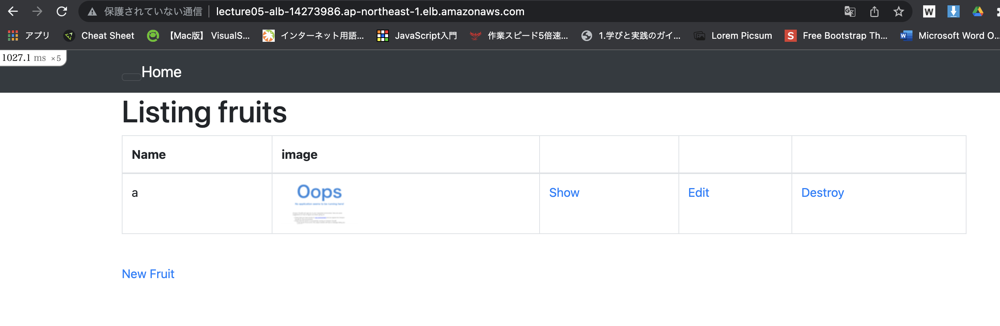


反映される


## S3設定


EC2が使用できるロールを作成し、そのロールにs3にアクセスできるポリシーを追加

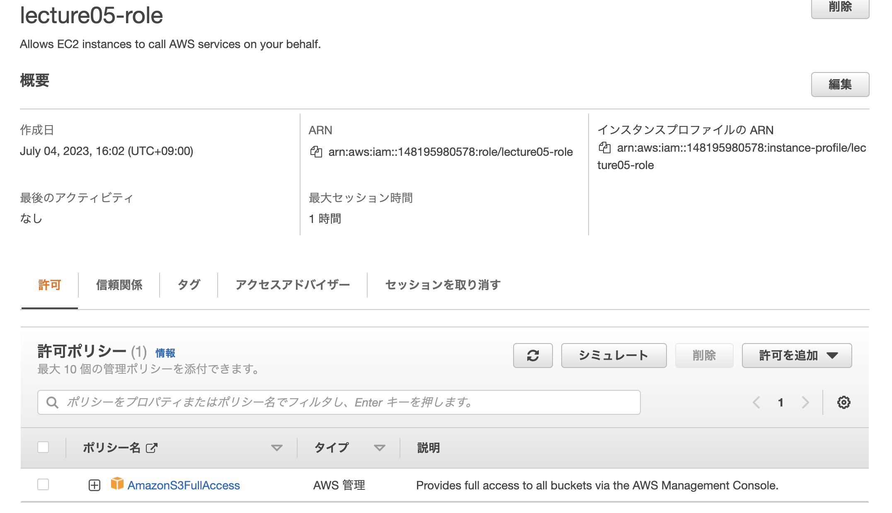

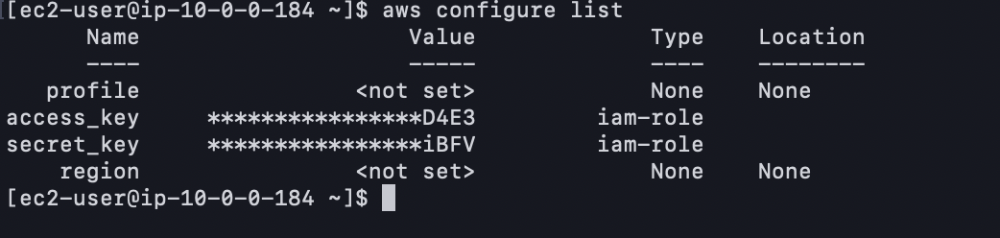

## 構成図


