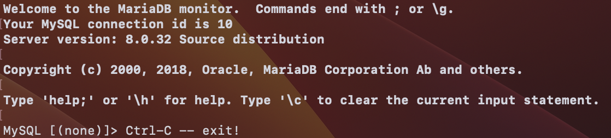
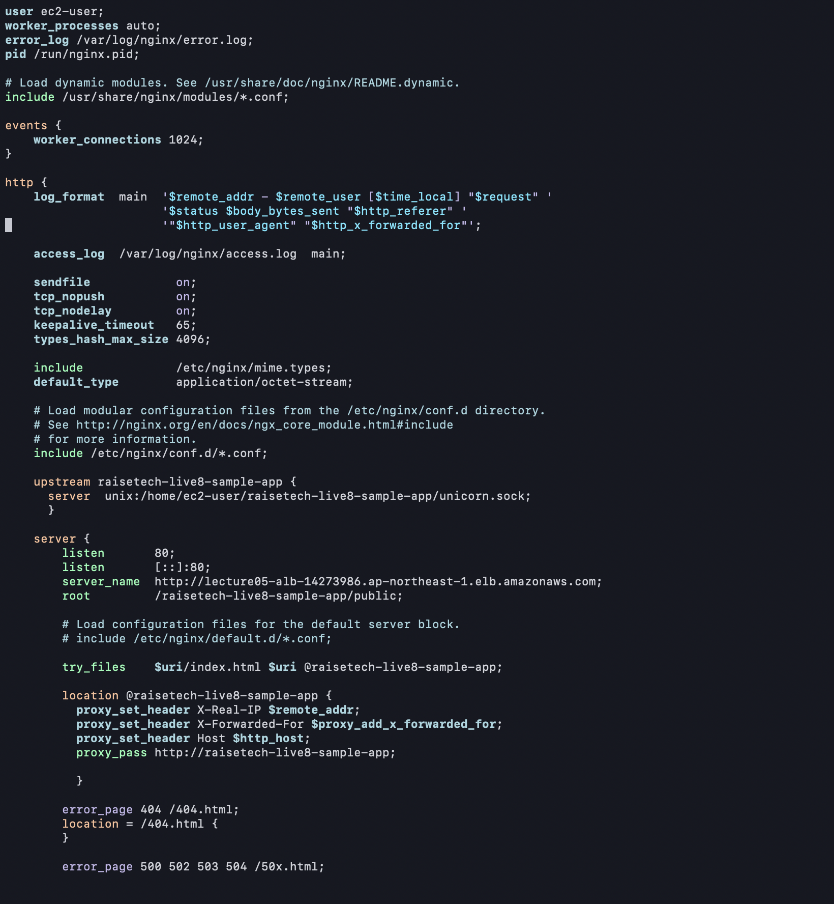
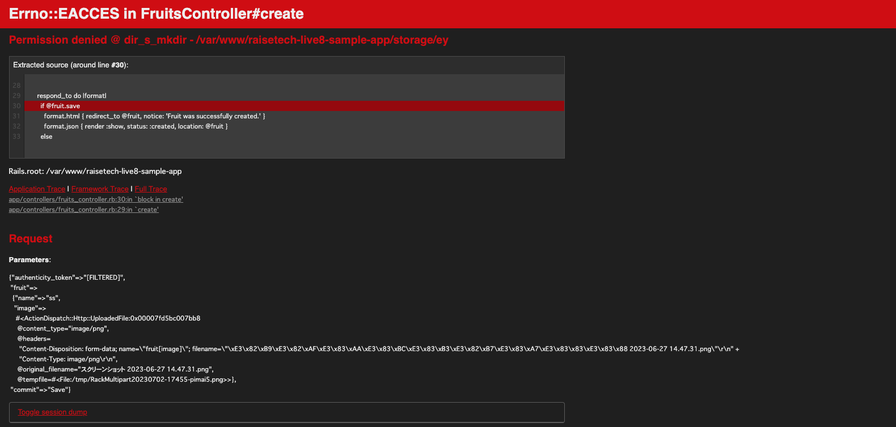

# 第5回課題

## 組み込みサーバの動作

``` sudo yum -y install mysql ```


ここで RDSにmysql -u ユーザ名 -h エンドポイント -p で接続しようとするが、タイムアウトになる。原因はEC2を作り直して、RDSのEC2接続セットアップを忘れていたためだった。



無事接続できました！

```sudo yum -y install gcc-c++ make patch git curl zlib-devel openssl-devel ImageMagick-devel readline-devel libcurl-devel libffi-devel libicu-devel libxml2-devel libxslt-devel```

railsアプリが動くようにパッケージをインストール

```sudo mkdir -p /var/www```

アプリの配置ディレクトリを作成


/var/www配下にアプリケーションをクローンする(git clone <リポジトリのURL>)

JavaScriptを実行できるように、Node.jsをインストール

```curl -sL https://rpm.nodesource.com/setup_14.x | sudo bash -```

↑AWSのリポジトリに追加するコマンド

```sudo yum -y install nodejs```

Rails6以降はyarnを使うので、yarnもインストールする

```curl -sL https://dl.yarnpkg.com/rpm/yarn.repo | sudo tee /etc/yum.repos.d/yarn.repo```

```sudo yum -y install yarn```

rubyのバージョン管理ツールであるrbenvをインストール


```
git clone https://github.com/sstephenson/rbenv.git ~/.rbenv

echo 'export PATH="$HOME/.rbenv/bin:$PATH"' >> ~/.bash_profile

echo 'eval "$(rbenv init -)"' >> ~/.bash_profile

sourc .bash_profile

```


sourceコマンドを打ったが反映されなかったので、一旦exitして再びEC2にSSH接続したら反映された。

rubyをインストールするためのruby-buildをインストール


```

git clone https://github.com/sstephenson/ruby-build.git ~/.rbenv/plugins/ruby-build

rbenv install 3.1.2

```


bundlerのインストール

```gem install bundler```


その前に、My SQLのセットアップするんだった(*･ω･)ﾉ


bundlerのインストール後、bin/setupを実行するとエラーが…


```sudo chown ec2-user raisetech-live8-sample-app/```


権限を与えて再び実行すると、またもエラー…


```sudo chown ec2-user /var/www/raisetech-live8-sample-app/tmp/```


これで再び実行すると、無事成功した。


```bin/dev```


また権限に関するエラーが出たので、修正。


```sudo chown ec2-user /var/www/raisetech-live8-sample-app/app/assets/builds/```


これでアプリケーションが起動した。


## Unicorn+Nginx

config/unicorn.rbの設定


```bundle exec unicorn_rails -c config/unicorn.rb```


###  Nginx動作確認

```sudo amazon-linux-extras install nginx1```


サーバ起動
```sudo amazon-linux-extras install nginx1```


起動成功


### /etc/nginx/nginx.confの設定



```sudo systemctl start nginx```


## RDS動作確認



写真を送信したら、↑このようなエラーが出たのでstorage/をPermissionをrootからec2-userに変更


エラーが解消され、画像もアップできた(いや、フルーツの画像じゃないんかい∑(ﾟДﾟ)）


## ELB起動確認


```sudo vi config/environments/development.rb```


development.rbに追加すると…


反映される


## S3設定


EC2が使用できるロールを作成し、そのロールにs3にアクセスできるポリシーを追加


