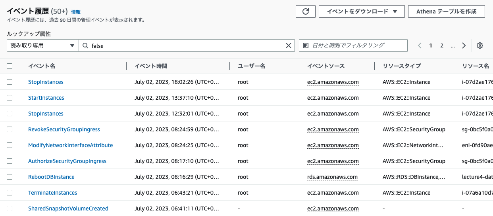
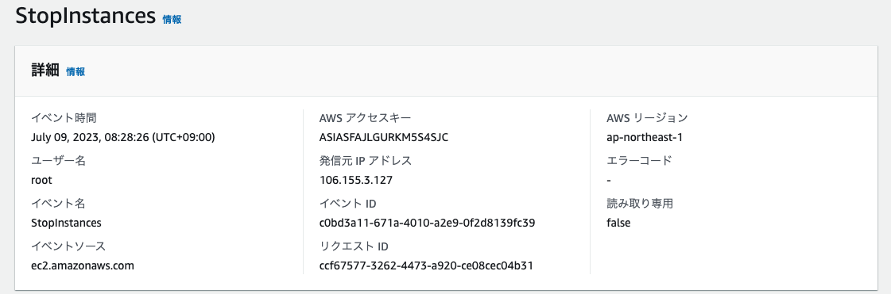
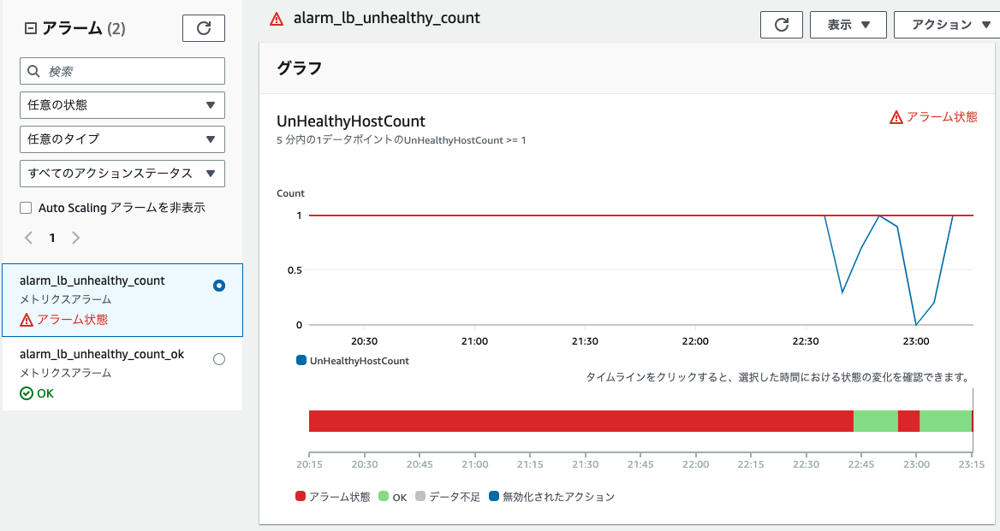
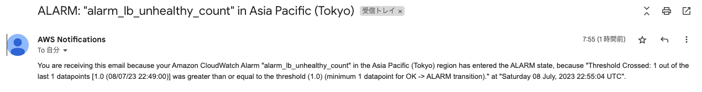
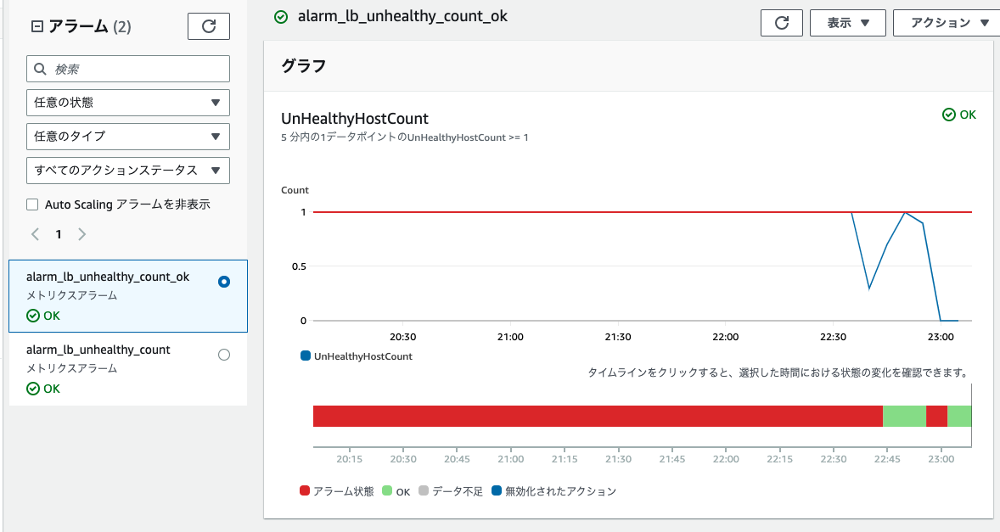
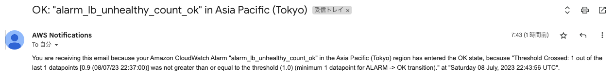
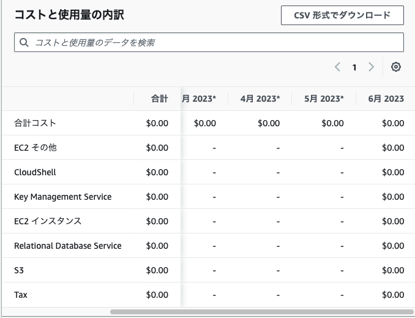

# 第6回課題

=======
## CloudTrailイベント履歴

- イベント名
  - StopInstances

- 含まれている内容
  - イベントソース
  - ユーザ名
  - AWSアクセスキー

## CloudWatch

### Railsアプリ起動停止の場合

### Railsアプリ起動状態の場合

## 利用料金

[見積もりURL](https://calculator.aws/#/estimate?id=03a9427894fdb9f295a93ad14d9751770fc5110e)

