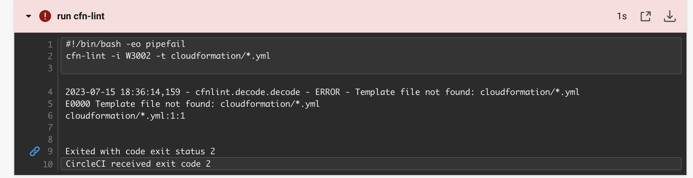
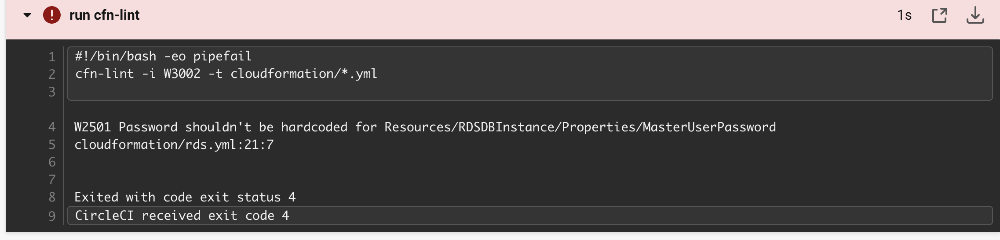
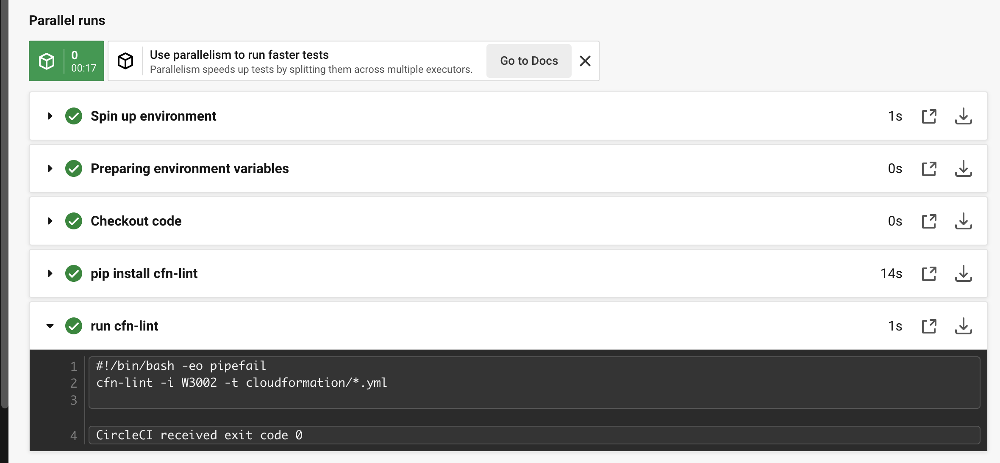

# 第12回課題

## CircleCi動作手順

プロジェクトのリポジトリ（RaiseTech)に、".circleci/config.yml"ファイルを作成する

上記のようなエラーが出たので、cloudformationフォルダを作り、その中にymlファイルを移動した。

再実行すると

RDSのパスワードがハードコードだったためエラー

ハードコードを直して再実行すると...

成功しました。

